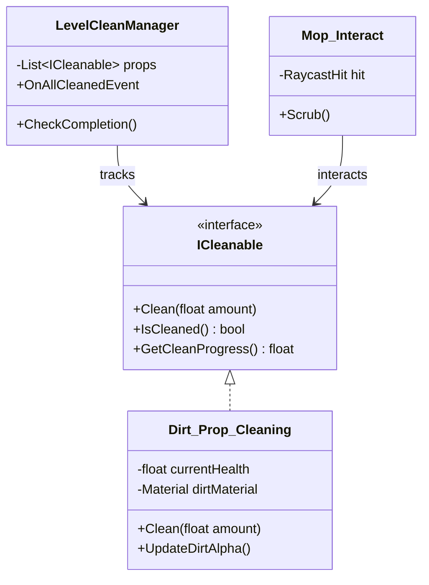

# Unity Gameplay Systems & Technical Toolkit

[](https://unity.com/)
[](https://unity.com/srp/universal-render-pipeline)
[](https://docs.microsoft.com/en-us/dotnet/csharp/)
[](LICENSE)

A production-ready suite of modular gameplay systems, physics controllers, and custom technical tools developed for atmospheric psychological horror and simulation titles in Unity (Universal Render Pipeline).

Showcased across LinkedIn and portfolio demonstrations, this repository houses:
1. 🚗 **Fears-to-Fathom Style First-Person Vehicle Controller**
2. 🧹 **Decoupled Cleaning & Environmental Dirt System**
3. 🔤 **RTLForge — Arabic & RTL Text Shaping Engine for TextMeshPro**
4. 📼 **Custom VHS Post-Processing ScriptableRendererFeature for URP**

---

## 📦 System Modules

### 1. First-Person Vehicle Driving System (`Assets/F2F/`)
An arcade-sphere raycast physics controller engineered specifically for immersive cockpit-perspective driving (inspired by *Fears to Fathom* and *Pacific Drive*).

* **Arcade-Sphere Suspension Physics**: Uses a smoothed Rigidbody with raycast ground detection, eliminating erratic physics collisions while delivering responsive road grip.
* **Realistic Interior Cockpit Synchronization**:
  * Smooth steering wheel rotation interpolation synced with input axes.
  * Head-camera inertia dampening (pitch and roll reactions to acceleration and cornering forces).
  * Raycast slope and surface normal alignment for seamless hill climbs.
* **Tunable Physics Variables**: Inspector-exposed parameters for engine acceleration, maximum top speeds, turn agility, braking deceleration, and drag.

```csharp
// F2F_CarController.cs excerpt
[RequireComponent(typeof(Rigidbody))]
public class F2F_CarController : MonoBehaviour
{
    [Header("=== MOVEMENT & HANDLING ===")]
    public float acceleration = 12f;
    public float maxSpeed = 20f;
    public float turnSpeed = 10f;
    public float brakeStrength = 8f;
    
    // Smooth ground alignment via surface normal raycasting
    void AlignWithGroundNormal() { ... }
}
```

---

### 2. Decoupled Cleaning & Surface System (`Assets/Cleaning_System/`)
A modular, interface-driven mechanic for simulation and atmospheric horror games where players clean environmental messes.

* **Interface-Driven Architecture (`ICleanable`)**: Any object (floor stain, dirty window, blood splatter, messy counter) can become cleanable simply by implementing `ICleanable`.
* **Tactile Mop Interaction (`Mop_Interact.cs`)**: Raycast tool interaction with scrub animations, sound effects, and progressive dirt removal.
* **Progress Tracking (`LevelCleanManager.cs`)**: Aggregates cleanliness percentages across all registered cleanable props to trigger room unlocks or narrative milestone events.



---

### 3. RTLForge — Arabic & RTL Text Engine (`Assets/RTLForge/`)
A complete typography engine enabling native, grammatically correct Arabic, Persian, and Urdu text shaping directly within Unity and TextMeshPro.

* **Contextual Glyph Shaping (`ArabicShaper.cs`)**: Solves isolated, initial, medial, and final character transformations based on unicode character adjacency.
* **Ligature & Harakat Resolution**: Handles complex Arabic ligatures (such as Lam-Alef `لا`) and diacritics without text corruption.
* **Dedicated Custom Editor Windows**:
  * `RTLForgeFontGeneratorWindow`: Generates TextMeshPro font assets with complete Arabic character ranges.
  * `RTLForgeFontValidatorWindow`: Scans existing fonts and reports missing Arabic unicode glyphs.
  * `RTLForgeArabicTestWindow`: Real-time interactive text shaping preview.

---

### 4. VHS Retro Post-Process Feature (`Assets/Fears to Fathom Vhs for URP/`)
A custom **ScriptableRendererFeature** and shader pass for Universal Render Pipeline (URP).

* **Analog Tape Artifacts**: Simulates authentic CRT and VHS tape tracking jitter, tape noise lines, luminance flicker, and interlacing scanlines.
* **Radial Chromatic Aberration**: Displaces RGB color channels toward screen edges to emulate vintage cathode-ray tube optics.
* **Zero Overhead**: Single blit pass executed directly in the URP render queue before final post-processing.

---

## 📁 Repository Structure

```
Assets/
├── F2F/
│   └── F2F_Driving/
│       └── Scripts/
│           └── F2F_CarController.cs            # Cockpit driving controller
├── Cleaning_System/
│   └── Scripts/
│       ├── ICleanable.cs                       # Interface contract for cleanable props
│       ├── Dirt_Prop_Cleaning.cs               # Concrete dirt prop implementation
│       ├── LevelCleanManager.cs                # Level completion manager
│       └── Mop_Interact.cs                     # Tool interaction controller
├── Fears to Fathom Vhs for URP/
│   ├── VHSPostProcessFeature.cs                # URP ScriptableRendererFeature blit pass
│   └── Shaders/                                # VHS distortion & scanline HLSL shaders
├── RTLForge/
│   ├── Runtime/Arabic/
│   │   ├── ArabicCharacter.cs                  # Glyph data structures
│   │   ├── ArabicShaper.cs                     # Contextual shaping engine
│   │   └── RTLForgeText.cs                     # Component replacement for TextMeshPro
│   └── Editor/                                 # Custom font generator & validator windows
└── ModularFirstPersonController/               # Polished FPS movement & camera rig
```

---

## 🚀 How to Integrate into Your Project

### Adding the F2F Car Controller
1. Attach a `Rigidbody` and the `F2F_CarController.cs` script to your vehicle root.
2. Assign the steering wheel transform and interior camera reference.
3. Configure suspension raycast points at wheel locations.

### Adding Cleanable Props
1. Attach `Dirt_Prop_Cleaning.cs` to any mesh with a dirt texture.
2. Attach `Mop_Interact.cs` to your player camera or interaction raycaster.
3. Place `LevelCleanManager.cs` in the scene to observe room clean percentages.

### Using RTLForge for Arabic Text
1. Add `RTLForgeText.cs` instead of standard `TextMeshProUGUI`.
2. Input Arabic text in standard typing order; the component automatically shapes and flips characters right-to-left at runtime.

---

## 👨‍💻 Author

**Yassir ESSABAHY**  
* Solo Game Developer & Systems Programmer  
* Portfolio: [yessirdev.vercel.app](https://yessirdev.vercel.app)  
* LinkedIn: [linkedin.com/in/yessir001](https://www.linkedin.com/in/yessir001/)  
* Instagram: [@thats_yessir](https://www.instagram.com/thats_yessir)
